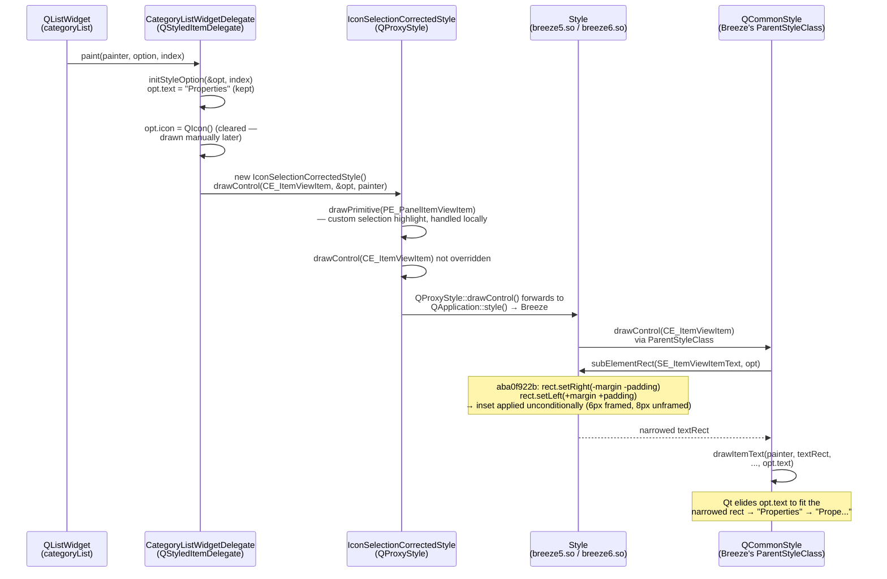
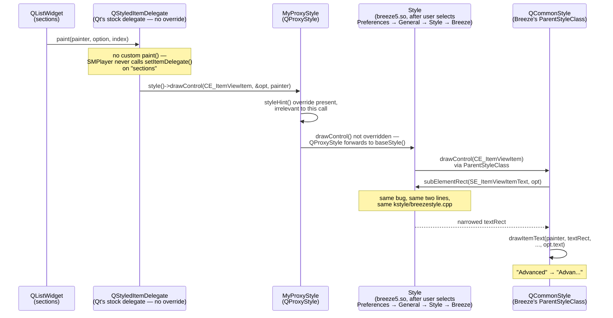

# Sequence Diagrams: Reaching Style::subElementRect(SE_ItemViewItemText)

*Part of the evidence set for KDE bug [523118](https://bugs.kde.org/show_bug.cgi?id=523118) — see the [repository overview](../README.md) for the full set.*

> **Partially superseded — see [Update 08/01/2026](#update-08012026) at the end
> of this document.** The 8px figure below describes an *unframed* item view.
> Framed views — which is every view in every application examined here — lose
> **6px**. The finding is otherwise unchanged, and the original text is kept as
> written.

Both diagrams below trace a real paint call, from the item view's paint
event down to the single function where the bug lives
(`Style::subElementRect(SE_ItemViewItemText)` in `kstyle/breezestyle.cpp`,
introduced by commit [`aba0f922b`](https://invent.kde.org/plasma/breeze/-/commit/aba0f922b7b872caa3043d0cfe43eec374aba431)).
Source basis: [`keepassxc-qt6-analysis.md`](keepassxc-qt6-analysis.md) for
KeePassXC (pristine upstream `keepassxc-2.7.12-1.fc43`, verified against
the actual installed/screenshotted build) and
[`smplayer-source-analysis.md`](smplayer-source-analysis.md) for SMPlayer
(`smplayer-25.6.0-2.fc43`).

Both chains terminate at the identical Qt/Breeze call — the divergence is
entirely in what each application puts *in front of* it, which is the point:
neither app decides how wide the text rect is. Breeze does.

---

## KeePassXC — CategoryListWidgetDelegate (Entry Edit dialog sidebar)

KeePassXC's delegate clears `opt.icon` and paints the icon itself afterward
(`painter->drawPixmap(...)`), but **does not** clear `opt.text` — the label
is left in `opt` and painted entirely inside `drawControl(CE_ItemViewItem)`,
which is the standard Qt path. `IconSelectionCorrectedStyle` only overrides
`drawPrimitive()` (for the rounded selection highlight) and, on Windows only,
`drawControl()` for a focus-color hack — on Linux, `drawControl()` is
untouched and falls straight through to Breeze.

---

## SMPlayer — Preferences sidebar (`sections` QListWidget)

SMPlayer's path is shorter: no custom delegate exists for `sections` at all,
so Qt's own `QStyledItemDelegate` handles `paint()` unmodified. `MyProxyStyle`
overrides only `styleHint()`, so `drawControl` and the `subElementRect` call
it triggers reach Breeze completely unmediated — SMPlayer's application code
never gets a chance to influence the text rect one way or the other.

---

## Why the Convergence Point Matters

Both diagrams reach the exact same function call:
`Style::subElementRect(SE_ItemViewItemText, viewItemOption, widget)`.
Neither application:

- computes its own text-clipping rect for this widget,
- calls `QFontMetrics::elidedText()` itself,
- or overrides `subElementRect` anywhere in its own proxy/delegate classes.

The third argument is the item view itself, not `nullptr`: KeePassXC passes
`opt.widget` into `drawControl(CE_ItemViewItem, …)`, SMPlayer's stock
`QStyledItemDelegate` passes the view it is painting, and `QCommonStyle`
forwards that pointer through to `subElementRect`. This detail matters because
Breeze's `Helper::itemViewItemMargins()` branches on
`qobject_cast<const QFrame *>(option->widget)` and
`qobject_cast<const QAbstractItemView *>(option->widget)` — so the margins it
returns can depend on what kind of widget is supplied. The `-v2` probes
(`make v2`) exist to close exactly that gap: they measure the same call against
a real, populated `QListWidget` with the widget pointer supplied consistently,
and report the same `diff=8` as the original probes. See
[`se-itemviewitemtext-proof.md`](se-itemviewitemtext-proof.md#6-hardened-cross-check-probe-v2).

The only variable between "labels fit" and "labels elide" in both apps is
which concrete `QStyle` instance answers that one call — confirmed directly
by the Fusion-vs-Breeze control comparison in
[`bug-analysis.md`](bug-analysis.md) and proven independent of any
application in [`se-itemviewitemtext-proof.md`](se-itemviewitemtext-proof.md).

---

## Update 08/01/2026

A second round of measurement, described in [`test-plan.md`](test-plan.md),
refined the size of the effect and identified two mechanisms this document
predates. Nothing here is retracted; the numbers are decomposed.

**The narrowing is 6px in a framed view, not 8px.**
`Helper::itemViewItemMargins()` reduces its left and right margins from 2px to
1px once it detects the view's `QFrame::StyledPanel`, making the inset
`1 + ItemView_ItemPaddingWidth` = 3px per side. The original probes measured the
unframed case because `QStyleOption::initFrom()` does not populate
`QStyleOptionViewItem::widget`, so Breeze's frame check never fired. Probe v3
reports both cases side by side, reproducing the 8px figures below as its
`*/noWidget` rows.

**A live view shows 8px less text than Fusion, but only 6px of it is this code
path.** The remaining 2px is Breeze's `PM_DefaultFrameWidth` returning
`Metrics::Frame_FrameWidth` (2) for a scroll area in a spaced multi-item layout
where Fusion returns 1 — a deliberate difference in frame thickness, unrelated
to text layout.

**Qt removes the padding a second time.**
`QCommonStylePrivate::viewItemDrawText()` removes `PM_FocusFrameHMargin + 1` from
each side of whatever `subElementRect()` returned, immediately before eliding.
The width the text is laid out in is `textWidth - 2 * textMargin`. On Qt 5.15,
where `viewItemLayout()` clamps the rect to the string's natural width whenever
`showDecorationSelected` is false — which is what Breeze's style hint reports —
this leaves every label short by exactly `2 * textMargin` at *any* view width.

See the [repository overview](../README.md) for the current suggested patch.
